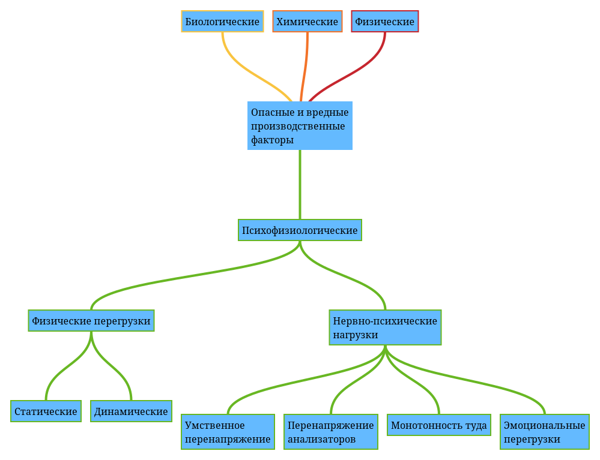

# Идентификация и воздействие на человека негативных факторов производственной среды

Знание методов и средств обеспечения безопасных и здоровых условий труда во многом определяет уровень профессиональной подготовленности любого специалиста, а приобретение таких знаний является целью изучения дисциплины «Охрана труда».

Предметом изучения дисциплины «Охрана труда» является система человек-машина-среда, рассматриваемая с позиций весьма важного практического требования-обеспечения безопасного функционирования.

Главными задачами изучения дисциплины «Охрана труда» являются:

* приобретение знаний, позволяющих идентифицировать (выявлять) опасные и вредные производственные факторы (ОВПФ) в машиностроении
* освоение системы технических мероприятий и средств по обеспечению безопасности труда в машиностроении
* освоение содержания основных вопросов управления промышленной безопасностью и охраной труда
* освоение основных направлений обеспечения пожарной безопасности на предприятиях и в организациях машиностроения

## Основные понятия и терминологии безопасности труда

*Охрана труда* --- это система сохранения жизни и здоровья работников в процессе трудовой деятельности, включающая в себя правовые, социально-экономические, организационно-технические, санитарно-гигиенические, лечебно-профилактические, реабилитационные и другие мероприятия.

*Техника безопасности* --- это система организационных мероприятий и технических средств, предотвращающих воздействие на работников опасных производственных факторов.

*Производственная санитария* --- это система организационных мероприятий и технических средств, предотвращающих или уменьшающих воздействие на работников вредных производственных факторов.

*Рабочая среда* --- это пространство, в котором осуществляется трудовая деятельность человека.

*Промышленная безопасность* --- это состояние защищенности жизненно важных интересов личности и общества от аварий на опасных производственных объектах и последствий указанных аварий.

*Опасные производственные объекты* --- это цехи, участки, площадки, на которых обращаются опасные вещества, используется оборудование, работающее под давлением 0.7MPa и выше или при температуре воды выше 115°C получаются расплавы черных и цветных металлов, ведутся горные работы, используются стационарно установленные грузоподъемные механизмы, эскалаторы, канатные дороги.

*Опасный производственный фактор* --- это производственный фактор, воздействие которого на работника в определенных условиях приводит к травме или другому внезапному резкому ухудшению здоровья.

*Вредный производственный фактор* --- это производственных фактор, воздействие которого на работников в определенных условиях приводит к заболеванию или снижению работоспособности, может перейти в опасный фактор.

*Безопасность труда* --- это состояние условий труда, при котором исключено воздействие на работников ОВПФ (Опасных вредных производственных факторов) либо уровни их воздействия не превышают установленных нормативов.

*Предельно допустимый уровень производственного фактора* --- уровень производственного фактора, воздействие которого при работе установленной продолжительности в течение всего трудового стажа не приводит к травме, заболеванию или отклонению в состоянии здоровья в процессе работы или в отдаленные сроки жизни настоящего и последующего поколений.

*Опасная зона* --- пространство, в котором возможно воздействие на работника опасного и (или) вредного производственных факторов.

*Средство защиты на производстве* --- средство, применение которого предотвращает или уменьшает воздействие на одного или более работников ОВПФ. Если указанные средства предназначены для защиты одного работника, то их называют индивидуальными, если для двух и более – коллективными.

## Классификация и номенклатура негативных факторов

*Идентификация ОВПФ* --- процесс выявления и оценки характеристик этих факторов. В ходе идентификации нужно выявить наименования возможных ОВПФ, их источники, фактические значения факторов, степень превышения допустимых значений.

По ГОСТ 12.0.003 все ОВПФ с учетом их материальной сущности и природы действия подразделяют на физические, химические, биологические, психофизиологические.

Физические ОВПФ включают в себя такие факторы, как:

* движущиеся машины и механизмы
* подвижные части производственного оборудования
* передвигающиеся изделия, заготовки,материалы
* разрушающиеся конструкции
* острые кромки, заусенцы, шероховатость на поверхностях заготовок, инструментов, материалов
* расположение рабочих мест на значительной высоте относительно поверхности земли (пола)
* обрушивающиеся горные породы, водные массы
* качка, невесомость
* повышенная запыленность и загазованность воздуха рабочей зоны
* повышенные или пониженные температуры поверхностей воздуха рабочей зоны
* повышенные или пониженные ионизация влажность, скорость движения воздуха, барометрическое давление в рабочей зоне и его резкое изменение
* повышенные уровни шума, вибрации, инфразвуковых колебаний, ультразвука, ионизирующих излучений в рабочей зоне, статического электричества, электромагнитных излучений, ультразвуковой и инфракрасной радиации
* повышенная напряженность электрического и магнитного полей
* повышенное значение напряжения в электрической цепи, замыкание которой может произойти через тело человека
* отсутствие или недостаток естественного света, недостаточная освещенность рабочей зоны, повышенная яркость света, пониженная контрастность, прямая и отраженная блесткость, повышенная пульсация светового потока

### Химические и биологические ОВПФ

*Химические ОВПФ* --- это вредные вещества и их соединения. По характеру действия на организм человека они могут быть токсическими, раздражающими, сенсибилизирующими, канцерогенными, мутагенными, влияющими на репродуктивную функцию. Вредные вещества могут проникать в организм человека через органы дыхания, желудочно-кишечный тракт, кожные покровы и слизистые оболочки.

Биологические ОВПФ включают в себя патогенные микроорганизмы (бактерии, вирусы, риккетсии, спирохеты, грибы, простейшие), а также опасные и вредные макроорганизмы (растения и животные).

### Психофизиологические ОВПФ

Психофизиологические ОВПФ с учетом природы их возникновения и характера действия подразделяют на физические перегрузки и нервно-психические перегрузки.

Физические перегрузки возможны при перемещении вручную каких-либо грузов и измеряются в единицах работы-джоуль (Дж) или килограмм-сила-метр.

Физические перегрузки могут быть статическими и динамическими. Статические перегрузки возникают при удержании инструмента, удержании тела в наклонном положении, тяге или толкании ручную, например грузовых тележек, и измеряются в единицах усилия, умноженных на время приложения усилия, т.е. в ньютон секунда.

Нервно--психические перегрузки подразделяют на умственное перенапряжение, перенапряжение анализаторов, монотонность труда и эмоциональные перегрузки.

### ПДУ и ПДК

В целях ограничения опасного и (или) вредного воздействия на работников различных неблагоприятных производственных факторов законодательством установлены их ПДУ, а применительно к вредным веществам --- ПДК.

Согласно ГОСТ 12.1.007 «ССБТ. Вредные вещества. Классификация и общие требования безопасности» по степени неблагоприятного воздействия на человека вредные вещества подразделяют на четыре класса:Согласно ГОСТ 12.1.007 «ССБТ. Вредные вещества. Классификация и общие требования безопасности» по степени неблагоприятного воздействия на человека вредные вещества подразделяют на четыре класса:

1. класс 1 --- чрезвычайно опасные, ПДК < 0,1 мг/м
2. класс 2 --- высокоопасные, ПДК = 0,1... 1,0 мг/м
3. класс 3 --- умеренно опасные, ПДК = 1,0... 10,0 мг/м3
4. класс 4 --- малоопасные, ПДК > 10,0 мг/м3

Согласно ГН 2.2.5.1313―03 «Предельно допустимые концентрации (ПДК) вредных веществ в воздухе рабочей зоны» ПДК для свинца --- 0,05 мг/м3 (среднесменная концентрация), озона --- 0,1, фенола --- 0,3, йода --- 1, азотная кислота --- 2, моющих средств --- 5, известняка --- 6, бензола --- 15, аммиака --- 20, ацетона --- 200 мг/м3 (среднесменная концентрация).

### Источники опасных и вредных производственных факторов

Опасно использование сложных технических систем, рассчитанных на то, что безопасность будет обеспечена только при безошибочном поведении человека.

В общем случае источниками ОВПФ являются недостаточная продуманность конструкций станков, машин, механизмов, отсутствие приборов и устройств безопасности, ограждений, блокировок, систем сигнализации о возникновении опасных режимов работы с последующей автоматической остановкой работы оборудования, недостаточная механизация и автоматизация технологических процессов, применение технологий, включающих в себя опасные производственные операции, отсутствие средств индивидуальной и коллективной защиты работников, неудачное размещение используемого оборудования.

Опасные и вредные производственные факторы могут возникать и как следствие нарушения самими работниками установленных технологических регламентов.

Опасные условия могут создаваться и по причине отсутствия постоянного контроля за соответствующими системами и устройствами (освещение, вентиляция, защитное заземление).

Многие ошибки человека, ведущие к несчастным случаям, объясняются тем, что в конструкциях производственного оборудования недостаточно учитываются условия, связанные с человеческим фактором, эргономикой, психологией.

### Опасные и вредные виды работ на производстве

Источниками некоторых ОВПФ являются металлообрабатывающие станки, кузнечно-прессовые машины и оборудование. Повышенный уровень шума характерен и для сборочных цехов многих машиностроительных предприятий, достигающий 90...92 дБА.

Источниками интенсивной локальной вибрации являются пневматические рубильные молотки, трамбовки, ручной механизированный инструмент, широко используемый на сборочных операциях.

Некоторые ОВПФ возникают при использовании смазочно охлаждающих жидкостей, применяемых при обработке металлов резанием. Контакты с такими жидкостями могут вызвать поражения кожного покрова кистей рук.

При отсутствии или недостаточной надежности ограждений, блокировок, тормозных устройств опасность может представлять движущийся режущий инструмент --- пилы, ножи, фрезы.

Источниками ОВПФ являются процессы нанесения металлических покрытий (пары органических растворителей, кислот, щелочей, аммония, соединений цинка, свинца, олова, меди, никеля, цианистых соединений), сварочные и окрасочные работы в машиностроении (повышенная запыленность и загазованность воздушной среды, повышенная температура поверхностей, тепловое и ультрафиолетовое излучение, брызги жидкого металла, открытое газовое пламя (газовая сварка и резка) и электрическая дуга (электрическая сварка)).

## Источники и характеристики негативных факторов и их воздействие на человека